Instalar Moodle en Almalibnux/Rockylinux 8
===================================

cómo instalar Moodle paso a paso, con lo que podremos trabajar con la plataforma de eLearning más usada en entornos de intranet

Antes de instalar Moodle en CentOS 7
++++++++++++++++++++++++++++++++++++++++++

Cumplir con estos requerimientos::

	# dnf update

	# dnf install -y policycoreutils-python wget

Cómo descargar Moodle
++++++++++++++++++++++++++++++++

LAMP debe estar instalado, Apache, MariaDB 10.5 o superior, PHP 7.4 o superior.

Vamos a descargar Moodle, concretamente la última versión disponible en su sitio web oficial: 

https://moodle.org/

Descomprimimos el paquete de Moodle que acabamos de descargar en su ubicación final::

	# tar xf moodle-4.1.tgz -C /var/www/html/
	
Crearemos el directorio de datos de Moodle::

	# mkdir /var/www/moodledata
	
Otorgamos los permisos en los directorio al usuario apache, esto es importante::

	# chown -R apache.apache /var/www/html/moodle
	
	# chown -R apache.apache /var/www/moodledata

Instalar LAMP
--------------

LAMP debe estar instalado, Apache, MariaDB 10.5 o superior, PHP 7.4 o superior.

ver este documento para PHP https://github.com/cgomeznt/Almalinux/blob/master/guia/lamp8.rst

ver este documenteo para MariaDB https://github.com/cgomeznt/MariaDB/blob/main/guia/instalarmariadb.rst

Instalando dependencias y/o pre requisitos
--------------------------

Instalamos las dependencias necesarias::

	# dnf -y install php-curl php-mbstring php-opcache php-xml php-gd php-intl php-xmlrpc php-soap php-pecl-zip

Si instalamos MariaDB::

	# dnf install php-mysql

Si instalamos Postgresql::

	# dnf install php-pgsql
	
Necesario realizar un ajuse en el archivo php.ini::

	# vi /etc/php.ini
	
Buscaremos la directiva max_input_vars en el contenido del archivo::

	...
	;max_input_vars = 1000
	...
	
Está desactivada por el carácter ; al inicio de línea, que eliminaremos, y cambiaremos el valor por defecto por 5000::

	...
	max_input_vars = 5000
	...

Recargamos apache::

	systemctl reload httpd
	
Preparar la Base de Datos
-------------------------

No olvide ejecutar el **mariadb-secure-installation**

El archivo de configuración del servidor (recordamos que en esta guía usamos MariaDB)::

	# vi /etc/my.cnf.d/server.cnf

En la sección server añadiremos estas líneas::

	...
	[server]
	...
	innodb_file_format = Barracuda
	innodb_file_per_table = 1
	innodb_large_prefix = on
	...
	
Y reiniciamos el servicio::

	# systemctl restart mariadb

Conectamos con nuestro usuario administrador de MariaDB/MySQL::

	# mysql -u root -p
	
Empezaremos creando la base de datos::

	> CREATE DATABASE moodle41 charset utf8mb4 collate utf8mb4_unicode_ci;

Creamos el usuario::

	> CREATE USER 'moodleuser'@localhost IDENTIFIED BY 'moodlepass';
	
Permisos sobre la base de datos::

	> GRANT ALL ON `moodle41`.* TO 'moodleuser'@localhost;

Para permitir el acceso desde cualquier otra computadora en la red::

	> GRANT ALL ON `moodle41`.* TO 'moodleuser'@'%';

Aplicar los cambios realizados::

	> FLUSH PRIVILEGES;

> exit

Reiniciamos los servicios para estar seguros::

	# systemctl restart httpd mariadb php-fpm
	
Preparamos el Apache
----------------

Creamos un Virtual Server::

	# vi /etc/httpd/conf.d/e-deus.cf-SSL.conf

	<VirtualHost *:443>
		Header always set Strict-Transport-Security "max-age=63072000; includeSubdomains; preload"
		Header set X-Frame-Options "DENY"
		ServerName e-deus.cf
		ServerAlias e-deus.cf
		DocumentRoot /var/www/html/moodle
		SSLEngine on
		#SSLCertificateFile /etc/httpd/conf.d/certs/srvutils.crt
		#SSLCertificateKeyFile /etc/httpd/conf.d/certs/srvutils.key
		#SSLCertificateChainFile /etc/httpd/conf.d/certs/CA_e-deus.cf.crt
		SSLCertificateFile /etc/letsencrypt/live/e-deus.cf/cert.pem
		SSLCertificateKeyFile /etc/letsencrypt/live/e-deus.cf/privkey.pem
		SSLCertificateChainFile /etc/letsencrypt/live/e-deus.cf/chain.pem
		# Habilitar unicamente el TLS 2
		SSLProtocol -all +TLSv1.3
		# Solo permitir Cipher stronge
		SSLCipherSuite ALL:+HIGH:!ADH:!EXP:!SSLv2:!SSLv3:!MEDIUM:!LOW:!NULL:!aNULL
		SSLHonorCipherOrder on
		SSLCompression      off
		SSLSessionTickets   off
	</VirtualHost>

El instalador web de Moodle
---------------------------------

Ya podemos introducir en el navegador la URL que corresponda

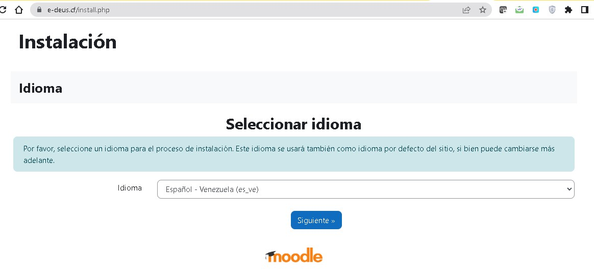

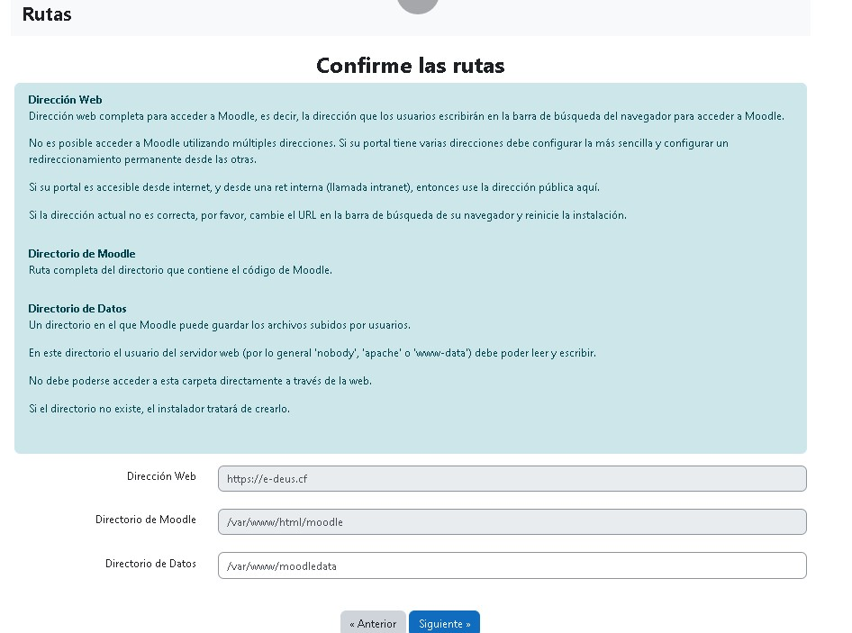

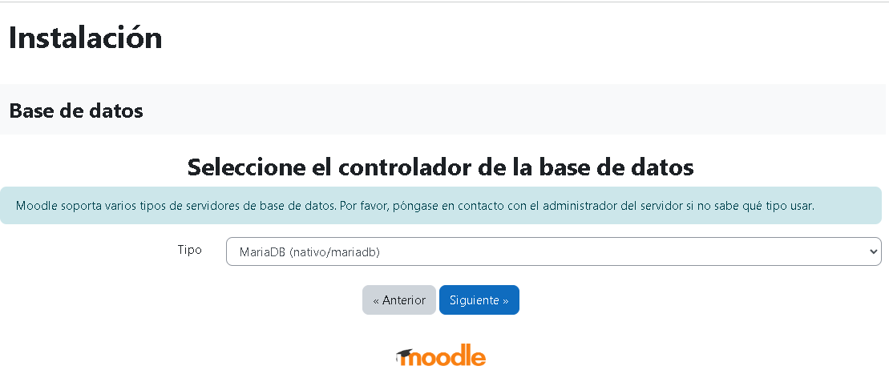

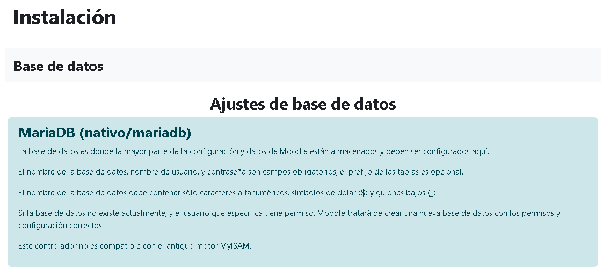

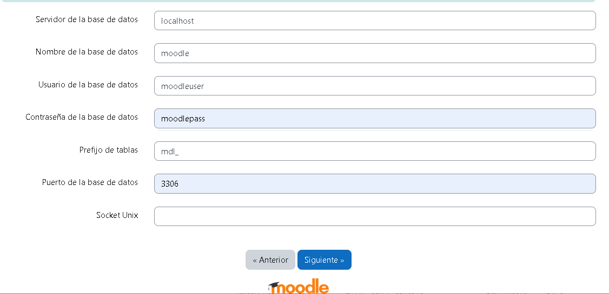

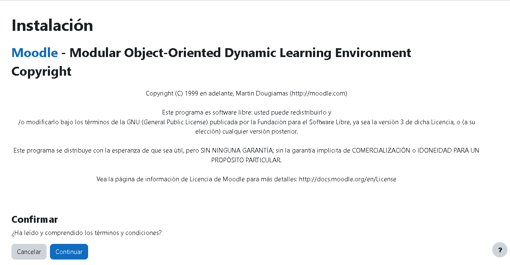

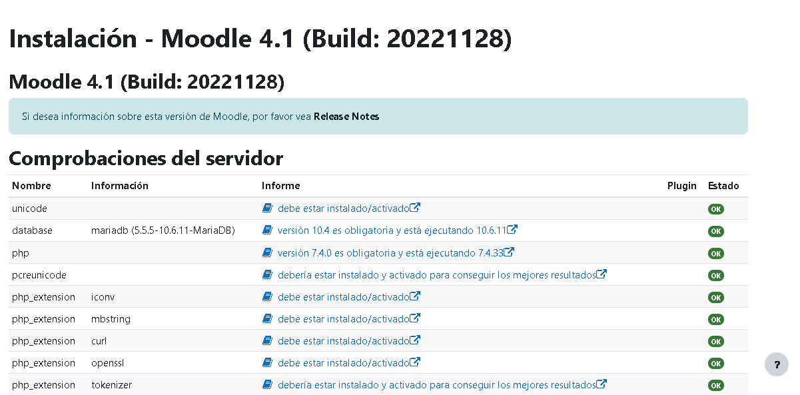

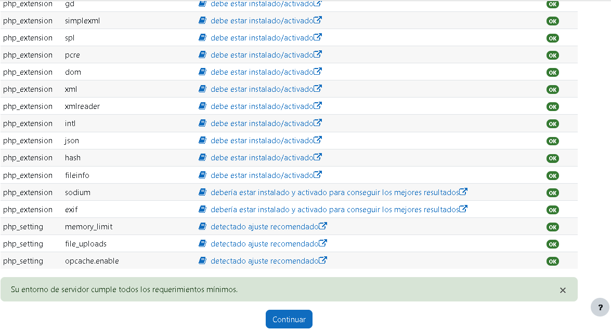

.. figure:: ../images/09.png

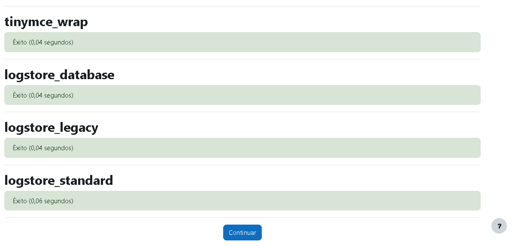

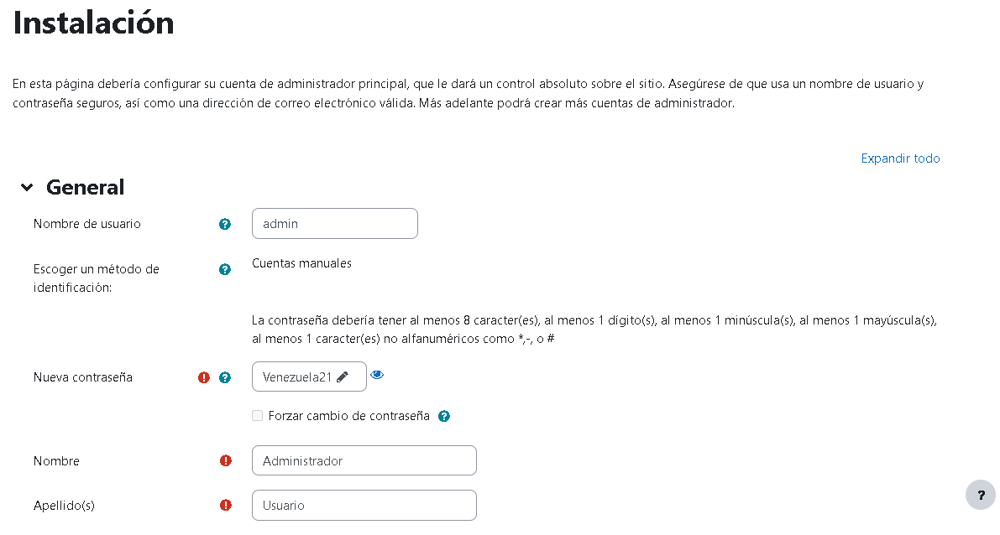

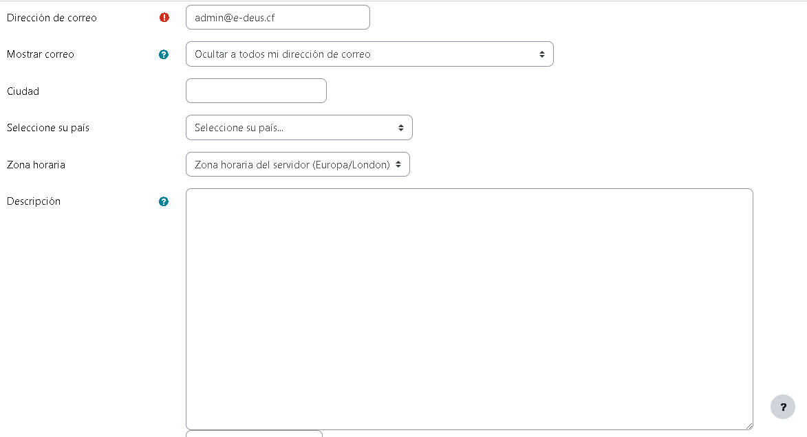

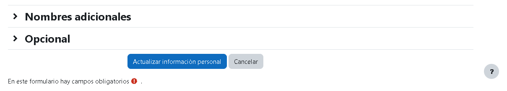

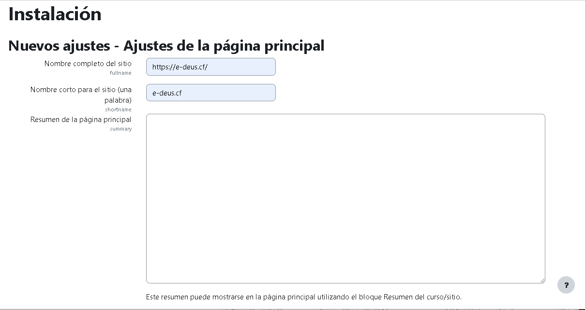

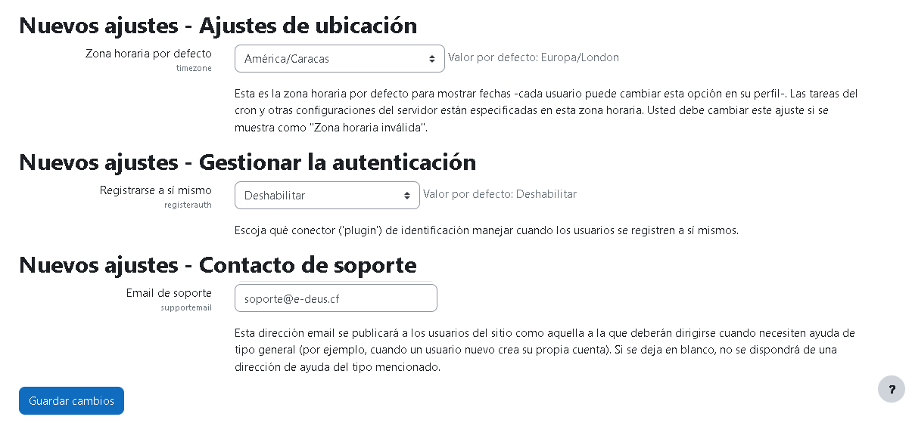

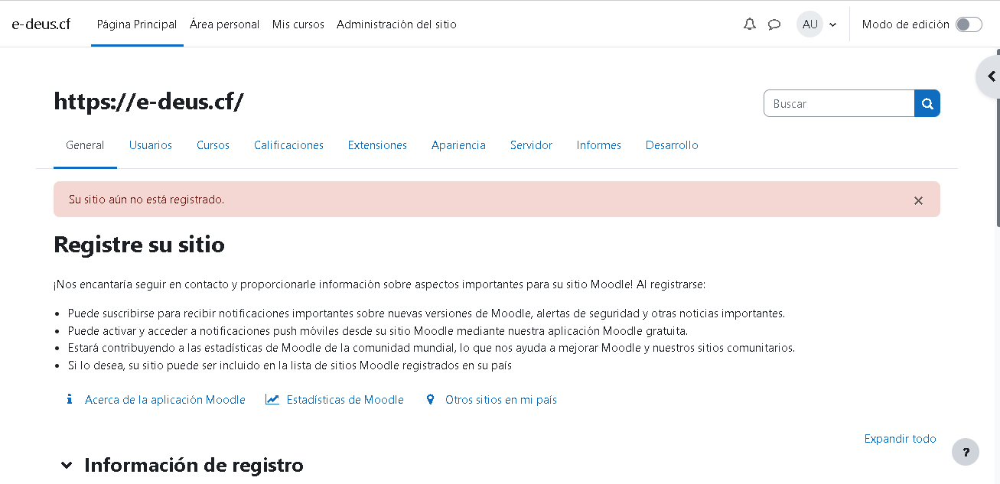

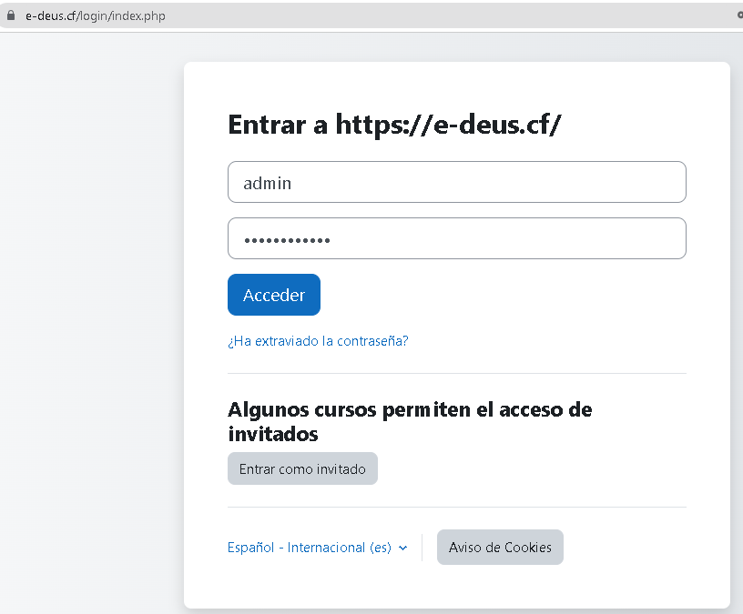

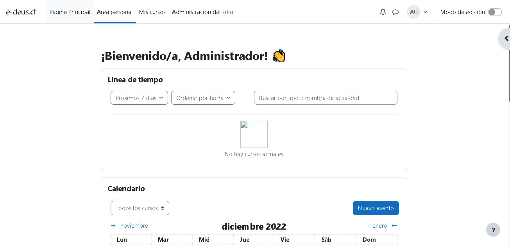

